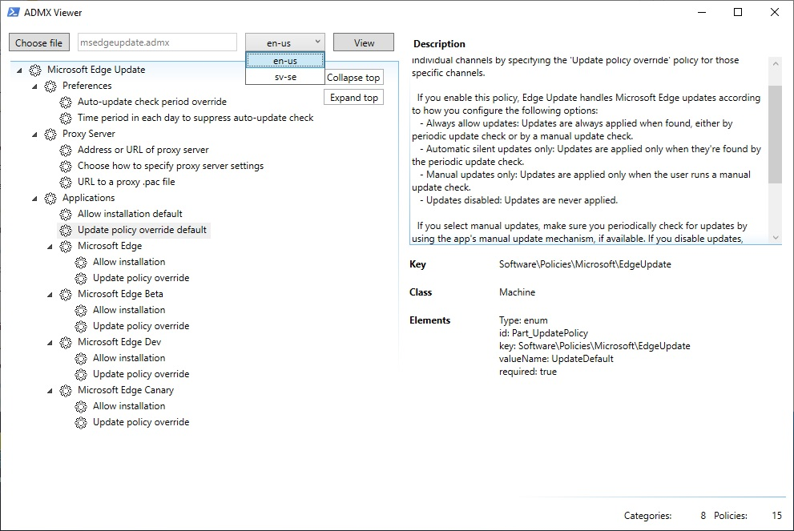

## Description

Want to view the settings available in an ADMX file without importing it into the local or central store and open ''Group Policy Management Console'' or ''gpdit.msc'', then this PSGUI could come in handy.

Or if you want to know the specific registry values that each setting applies this simplifies the view of that setting....

## Configure file association

Added possibility to open an ADMX file directly by association, use below registry setting to achieve this:

HKEY_CURRENT_USER\Software\Classes\.admx_auto_file\shell\open\command

(Default)

powershell.exe -file "[PATH TO FILE]\ADMXViewer.ps1" "%1"

(if you open an ADMX file with many settings it might take a while to open, no progress bar at this point showing anything until the window pops up)

## Example

