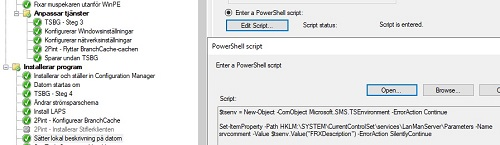

# INSTALLSERVER

## Task Sequence step 1 - Start InstallServer


Trigger the GUI for InstallServer through the built-in script execution


## Task Sequence step 2 - Configure network settings


The TS variable %FRXOU% is set through the main script and used to place the computer object in this step

## Task Sequence step 3 - Set local computer description



```$tsenv = New-Object -ComObject Microsoft.SMS.TSEnvironment -ErrorAction Continue```

```Set-ItemProperty -Path HKLM:\SYSTEM\CurrentControlSet\services\LanManServer\Parameters -Name srvcomment -Value $tsenv.Value("FRXDescription") -ErrorAction SilentlyContinue```

## Task Sequence step 4 - Set computer description in AD


```$TSEnv = New-Object -ComObject Microsoft.SMS.TSEnvironment -ErrorAction Continue```

```$DomainDN = "LDAP://CN=$($TSEnv.Value("FRXComputerName")),$($TSEnv.Value("FRXOU"))"```
```$Computer = New-Object -TypeName System.DirectoryServices.DirectoryEntry -ArgumentList $DomainDN,$($TSEnv.Value("FRXCustomUserName")),$($TSEnv.Value("FRXCustomUserInfo"))```
```$Computer.description = $TSEnv.Value("FRXDescription")```
```$Computer.setinfo()```

## Task Sequence step 2 - Add service window groups


```$TSEnv = New-Object -ComObject Microsoft.SMS.TSEnvironment -ErrorAction Continue```

```$DomainDN = "LDAP://CN=$($TSEnv.Value("FRXComputerName")),$($TSEnv.Value("FRXOU"))"```
```$Computer = New-Object -TypeName System.DirectoryServices.DirectoryEntry -ArgumentList``` ```$DomainDN,$($TSEnv.Value("FRXCustomUserName")),$($TSEnv.Value("FRXCustomUserInfo"))```

```foreach ( $MW in $($TSEnv.GetVariables() | where { $_ -like "FRXMW*" }) ) {```
```    $DomainDN = "LDAP://CN=$($TSEnv.Value($MW)),OU=MaintenanceGroups,DC=froxxen,DC=com"```
```    $MWGroup = New-Object -TypeName System.DirectoryServices.DirectoryEntry -ArgumentList $DomainDN,$($TSEnv.Value("FRXCustomUserName")),$($TSEnv.Value("FRXCustomUserInfo"))```
```    $MWGroup.Add($Computer.ADSPath)```
```}```

## Task Sequence step 6 - Configure NIC settings


```$tsenv = New-Object -ComObject Microsoft.SMS.TSEnvironment -ErrorAction Continue```
```New-NetIPAddress –IPAddress $tsenv.Value("FRXIPAddress") -DefaultGateway $tsenv.Value("FRXGateway") -PrefixLength $tsenv.Value("FRXSubnet") -InterfaceIndex (Get-NetAdapter).InterfaceIndex```

```Set-DNSClientServerAddress –InterfaceIndex (Get-NetAdapter).InterfaceIndex –ServerAddresses $tsenv.Value("FRXDNSPrimary"),$tsenv.Value("FRXDNSSecondary")```
